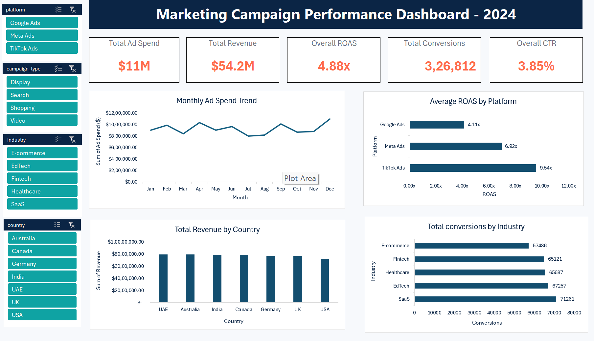

# Marketing Ad Campaign Performance Dashboard (Excel)

Interactive Excel dashboard analyzing 1,800 ad campaigns across Google Ads, Meta Ads and TikTok Ads (2024) to find which platforms, campaign types and industries deliver the best return on ad spend.

## Headline numbers

| Total Ad Spend | Total Revenue | Overall ROAS | Total Conversions | Overall CTR |
|---|---|---|---|---|
| $11M | $54.2M | 4.88x | 326,812 | 3.85% |

## Business questions

I framed 15 questions before building anything, grouped by theme:

- **Platform:** Which platform has the best ROAS and lowest CPA? Does spend match returns?
- **Geography:** Which countries drive the most revenue and best ROAS?
- **Industry:** Which industries convert best and cost the most to acquire customers in?
- **Campaign type:** Which of Search / Video / Shopping / Display performs best?
- **Time:** How do spend, ROAS and revenue trend across 2024?
- **Cross-dimension:** Which platform + country combination gives the best ROAS?

## Key insights

### 1. TikTok Ads delivers the strongest returns in every market
TikTok averages **9.54x ROAS** and a **$29.20 CPA**, versus Meta (6.92x, $39.10) and Google Ads (4.11x, $64.06). TikTok beats both other platforms in all 7 countries, with its weakest market (USA, 8.44x) still well above every Google Ads market. Yet Google Ads receives about **57% of total spend** ($6.35M of $11.1M).

**Recommendation:** Shift budget from Google Ads toward TikTok Ads, starting with Canada (10.19x) and Australia (10.01x).

### 2. Search campaigns lead on both efficiency and engagement
Search has the highest ROAS (**7.00x**) and CTR (**3.94%**). Shopping has the lowest ROAS (5.98x) and Video has the lowest CTR (3.76%).

**Recommendation:** Direct incremental spend to Search, review Shopping targeting, and test new Video creative to lift click-through.

### 3. SaaS is the strongest industry on volume and revenue
SaaS leads in conversions (**71,261**) and revenue (**$11.9M**). Its CPA ($45.77) is second-lowest, but CPA only varies from $45.04 to $48.04 across all five industries, so acquisition cost is not a strong differentiator here.

**Recommendation:** Use SaaS as the benchmark segment, and weigh budget decisions on volume and revenue rather than CPA alone.

### 4. Performance is seasonal, peaking in Q4
December has the highest spend ($1.10M), revenue ($5.16M) and ROAS (7.17x), with October close behind (7.10x). June has the lowest ROAS (5.78x), and July has the lowest spend ($0.80M) and revenue ($3.70M).

**Recommendation:** Weight budget toward Q4 and investigate the mid-year dip before committing heavy summer spend.

## Methodology notes

- **Overall ROAS (4.88x)** = total revenue ÷ total ad spend, so larger campaigns carry more weight.
- **Group figures** (e.g. TikTok 9.54x) are the average of campaign-level ROAS, so small campaigns count equally. This is why they run higher than the overall figure. Both are valid, but they answer slightly different questions.
- CTR, CPC, CPA and ROAS were rebuilt with my own formulas and checked against the source columns, which matched.

## What's in the workbook

| Sheet | Purpose |
|---|---|
| `Raw_Data` | Original dataset, untouched |
| `Cleaned_Data` | Working copy with formula-driven CTR, CPC, CPA, ROAS and fixed date formats |
| `Pivot_Analysis` | 15 PivotTables, one per business question |
| `Dashboard` | KPI cards, 4 charts and 4 slicers |

## Skills demonstrated

- Data cleaning (converting text dates to real dates, keeping raw data separate)
- Formula-based metrics (CTR, CPC, CPA, ROAS) with validation against source values
- PivotTables with date grouping, Sum vs Average handling for ratio metrics
- Charts with honest axes (bar charts start at zero)
- Slicers connected across multiple PivotTables, with KPI cards driven by a helper PivotTable so they respond to filters
- Dashboard design: consistent theme, clear hierarchy, insights with recommendations

## Data source

Global Ads Performance (Google, Meta, TikTok) dataset by Nudrat Abbas, from Kaggle. Findings apply to this dataset only.

## How to use

Download `Marketing_Ad_Campaign_Dashboard.xlsx` and open the `Dashboard` sheet in desktop Excel. Click the slicers to filter every chart and KPI at once.

Built by [vidhi-nagora](https://github.com/vidhi-nagora)
